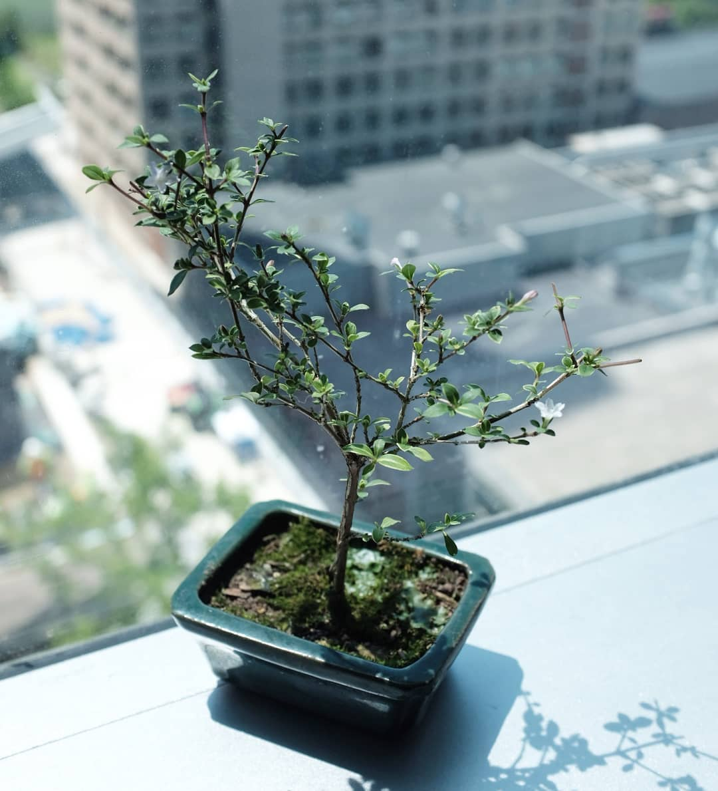

# Water my Bonsai

**[weekend hacking]** Raspberry Pi automated planting watering. I follow [hackster.io](https://www.hackster.io/ben-eagan/raspberry-pi-automated-plant-watering-with-website-8af2dc)
for hardware and software. I use the system to water my [Serissa Bonsai](https://www.bonsaioutlet.com/serissa-bonsai-care/).

  
  
  

## Installation on Raspberry Pi 3

- Install [`NOOBS Lite`](https://www.raspberrypi.org/downloads/noobs/)
- Update `apt-get` and install main packages like `git-core`
- Install [`miniconda`](http://www.aiminno.com/aimlab-docs/AIMRobot_BaseSetup.html#install-python)
- Check if noobs lite has GPIO, if not install via [wiringpi](http://www.aiminno.com/aimlab-docs/AIMRobot_BaseSetup.html#gpio)
- Install  [`RPi.GPIO`](https://pypi.org/project/RPi.GPIO/),
 [`psutil`](https://github.com/giampaolo/psutil), and [`flask`](https://github.com/pallets/flask) libraries for Python

## Hardware

- [Raspberry Pi 3 Model B](https://www.hackster.io/raspberry-pi/products/raspberry-pi-3-model-b)
- SainSmart 4-Channel Relay Module
- 3-6V Mini Micro Submersible Pumps
- [SparkFun Soil Moisture Sensor](https://www.hackster.io/sparkfun/products/sparkfun-soil-moisture-sensor-with-screw-terminals1)
- Flexible Water Line (Elite Silicone Airline Tubing for Aquarium)
- 120 pieces Multicolored Dupont Wire
